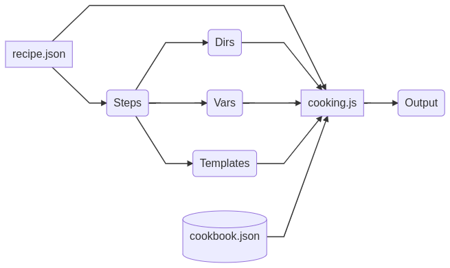

# chicote      <a href='https://ko-fi.com/I2I012UF3' target='_blank'></a>


Agnostic template engine code generator

(Chicote is a famous Spanish chef)

Chicote need NodeJS to work. Use [mustache.js](https://github.com/janl/mustache.js), [pluralize](https://github.com/plurals/pluralize), [voca](https://github.com/panzerdp/voca) and [faker.js](https://github.com/Marak/faker.js). You don't need install anything, only download code and call cooking.js

```
node cooking.js
```

## recipe.json

You need create a recipes.json, recipes contains one or more recipes a recipe contains all ingredients and steps.

* Recipe is a complete description for one execution of chicote
* Ingredient is any value in recipe json. Ingredients are accesible from templates.
* Steps are an array with name "steps". An step is the name of a json file in step directory

Example of recipe.json

```javascript
[
{	
    "name": "Test",
	"author": "Bob",
	"fields": [
		{"name": "id", "type": "int"},
		{"name": "firstname", "type": "String"},
		{"name": "lastname", "type": "String"},
		{"name": "birthday", "type": "date"}
	],
	"names": ["HelloWorld", "helloWorld", "hello-world"],
	"steps": ["example"]
},
...
]
```

## Steps

One step is a JSON file in directory "steps" where you prepare ingredients. One step have three parts: vars, directories, templates  
* vars are variables creates from ingredients. Work similar to ingredients
* directories indicates directories to output
* templates, text files in template directory 

Example of step
```javascript
{
    "vars":[
        ["filename1", "exampleA-{{timestamp}}.code"],
        ["filename2", "exampleB-{{timestamp}}.code"],
        ["className", "{{#capital}}{{name}}{{/capital}}"],
        ["varName", "{{#decapital}}{{name}}{{/decapital}}"],
        ["moduleName", "{{#dash}}{{name}}Module{{/dash}}"]
    ],	
    "directories":[
        "example/example1",
        "example/example2",
        "examples/example1/example2"
    ],
    "templates":[
        ["example/example1.text", "text.txt"],
        ["example/example1.text", "example/example1/{{filename1}}"],
        ["example/example2.text", "example/example2/{{filename2}}"],
        ["example/example1.text", "examples/example1/{{filename1}}"],
        ["example/example2.text", "examples/example1/example2/{{filename2}}"]
    ]
}
```

## Templates

Templates are text files in directory "templates" uses mustache syntaxis but with a few "special tags":

{{timestamp}}  
{{date}} - date in format yyyy-mm-dd
{{time}} - time in format hh:mm:ss
{{year}}
{{month}}
{{day}}
{{year}}
{{minute}}
{{second}}
{{GUID}}  

{{#plural}}text{{/plural}}  
{{#camel}}text{{/camel}}  
{{#capital}}text{{/capital}}   
{{#decapital}}text{{/decapital}}  
{{#dash}}text{{/dash}}  
{{#snake}}text{{/snake}}  
{{#swap}}text{{/swap}}  
{{#title}}text{{/title}}  
{{#lower}}text{{/lower}}  
{{#upper}}text{{/upper}}  
{{#slug}}text{{/slug}}  
{{#reverse}}text{{/reverse}}  
{{#stripTags}}text{{/stripTags}}  
{{#escHtml}}text{{/escHtml}}  
{{#unHtml}}text{{/unHtml}}  
{{#escRegExp}}text{{/escRegExp}}  
{{#trim}}text{{/trim}}  
{{#latin}}text{{/latin}}  

{{#count}}text{{/count}} - remplace text for number of characters    
{{#countWords}}text{{/countWords}}  - remplace text for number of words  

{{#delSpaces}}text{{/delSpaces}} - del all spaces  
{{#delDuplicateSpaces}}text{{/delDuplicateSpaces}} - del duplicate spaces   
{{#delLast|C}}text{{/delLast|C}} - del last C character coincidence  
{{#delFirst|C}}text{{/delFirst|C}} - del first C character coincidence  
{{#delEnd|N}}text{{/delEnd|N}} - del N characters from end  
{{#delStart|N}}text{{/delStart|N}} - del N characters from start  
  
{{#repeat|N}}text{{/repeat2|N}} - repeat text N time  
  
{{#sortAscL}}text{{/sortAscL}} - ascending sort lines   
{{#sortDescL}}text{{/sortDescL}} - descending sort lines  
{{#naturalSortAscL}}text{{/naturalSortAscL}} - ascending natural sort lines  
{{#naturalSortDescL}}text{{/naturalSortAscL}} - descending natural sort lines  
{{#shuffleL}}text{{/shuffleL}} - shuffle lines  
{{#trimL}}text{{/trimL}} - trim lines  
{{#joinL}}text{{/joinL}} - join lines  
{{#removeDuplicateL}}text{{/removeDuplicateL}} - remove duplicate lines  
{{#spaceL|N}}text{{/spaceL|N}} - Add N space at beginning each line   
{{#tabL|N}}text{{/tabL|N}} - Add N tabs at beginning each line  
{{#addStartL|C}}text{{/addStartL|C}} - Add character C at beginning each line   
{{#addEndL|C}}text{{/addEndL|C}} - Add character C at the end each line  

{{#log}}text{{/log}} - write text in console   
{{#eval}}text{{/eval}} - eval evaluate text as JS code  
{{#R}}text{{/R}} - render text  
  
{{#C=|N}}{{/C=|N}} - set counter to N  
{{#C+|N}}{{/C+|N}} - increase counter in N  
{{#C-|N}}{{/C-|N}} - decrease counter in N  
{{#C}}{{/C}} - print counter  

{{#K}}text{{/K}}  - load data from knowledge database (cookbook.json)  
  
{{!text}} - Comment  
  

  
Example:
  
```
Hello world
plural: Hello worlds
camel: helloWorld
capital: Hello world
decapital: hello world
dash: hello-world
snake: hello_world
swap: hELLO WORLD
title: Hello World
lower: hello world
upper: HELLO WORLD
escHtml: Hello world
slug: hello-world
count: 11
countWords: 2

HelloWorld
plural: HelloWorlds
camel: helloWorld
capital: HelloWorld
decapital: helloWorld
dash: hello-world
snake: hello_world
swap: hELLOwORLD
title: HelloWorld
lower: helloworld
upper: HELLOWORLD
escHtml: HelloWorld
slug: hello-world
count: 10
countWords: 2

helloWorld
plural: helloWorlds
camel: helloWorld
capital: HelloWorld
decapital: helloWorld
dash: hello-world
snake: hello_world
swap: HELLOwORLD
title: HelloWorld
lower: helloworld
upper: HELLOWORLD
escHtml: helloWorld
slug: hello-world
count: 10
countWords: 2

hello-world
plural: hello-worlds
camel: helloWorld
capital: Hello-world
decapital: hello-world
dash: hello-world
snake: hello_world
swap: HELLO-WORLD
title: Hello-World
lower: hello-world
upper: HELLO-WORLD
escHtml: hello-world
slug: hello-world
count: 11
countWords: 2

helloworld
plural: helloworlds
camel: helloworld
capital: Helloworld
decapital: helloworld
dash: helloworld
snake: helloworld
swap: HELLOWORLD
title: Helloworld
lower: helloworld
upper: HELLOWORLD
escHtml: helloworld
slug: helloworld
count: 10
countWords: 1
```
{{#faker}}data{{\faker}} - generate a random Faker.js data. 

Data could be any of these keys:

* address
  * zipCode
  * zipCodeByState
  * city
  * cityPrefix
  * citySuffix
  * cityName
  * streetName
  * streetAddress
  * streetSuffix
  * streetPrefix
  * secondaryAddress
  * county
  * country
  * countryCode
  * state
  * stateAbbr
  * latitude
  * longitude
  * direction
  * cardinalDirection
  * ordinalDirection
  * nearbyGPSCoordinate
  * timeZone
* animal
  * dog
  * cat
  * snake
  * bear
  * lion
  * cetacean
  * horse
  * bird
  * cow
  * fish
  * crocodilia
  * insect
  * rabbit
  * type
* commerce
  * color
  * department
  * productName
  * price
  * productAdjective
  * productMaterial
  * product
  * productDescription
* company
  * suffixes
  * companyName
  * companySuffix
  * catchPhrase
  * bs
  * catchPhraseAdjective
  * catchPhraseDescriptor
  * catchPhraseNoun
  * bsAdjective
  * bsBuzz
  * bsNoun
* database
  * column
  * type
  * collation
  * engine
* datatype
  * number
  * float
  * datetime
  * string
  * uuid
  * boolean
  * hexaDecimal
  * json
  * array
* date
  * past
  * future
  * between
  * betweens
  * recent
  * soon
  * month
  * weekday
* fake
* finance
  * account
  * accountName
  * routingNumber
  * mask
  * amount
  * transactionType
  * currencyCode
  * currencyName
  * currencySymbol
  * bitcoinAddress
  * litecoinAddress
  * creditCardNumber
  * creditCardCVV
  * ethereumAddress
  * iban
  * bic
  * transactionDescription
* git
  * branch
  * commitEntry
  * commitMessage
  * commitSha
  * shortSha
* hacker
  * abbreviation
  * adjective
  * noun
  * verb
  * ingverb
  * phrase
* helpers
  * randomize
  * slugify
  * replaceSymbolWithNumber
  * replaceSymbols
  * replaceCreditCardSymbols
  * repeatString
  * regexpStyleStringParse
  * shuffle
  * mustache
  * createCard
  * contextualCard
  * userCard
  * createTransaction
* image
  * image
  * avatar
  * imageUrl
  * abstract
  * animals
  * business
  * cats
  * city
  * food
  * nightlife
  * fashion
  * people
  * nature
  * sports
  * technics
  * transport
  * dataUri
  * lorempixel
  * unsplash
  * lorempicsum
* internet
  * avatar
  * email
  * exampleEmail
  * userName
  * protocol
  * httpMethod
  * url
  * domainName
  * domainSuffix
  * domainWord
  * ip
  * ipv6
  * port
  * userAgent
  * color
  * mac
  * password
* lorem
  * word
  * words
  * sentence
  * slug
  * sentences
  * paragraph
  * paragraphs
  * text
  * lines
* mersenne
  * rand
  * seed
  * seed_array
* music
  * genre
* name
  * firstName
  * lastName
  * middleName
  * findName
  * jobTitle
  * gender
  * prefix
  * suffix
  * title
  * jobDescriptor
  * jobArea
  * jobType
* phone
  * phoneNumber
  * phoneNumberFormat
  * phoneFormats
* random
  * number
  * float
  * arrayElement
  * arrayElements
  * objectElement
  * uuid
  * boolean
  * word
  * words
  * image
  * locale
  * alpha
  * alphaNumeric
  * hexaDecimal
* system
  * fileName
  * commonFileName
  * mimeType
  * commonFileType
  * commonFileExt
  * fileType
  * fileExt
  * directoryPath
  * filePath
  * semver
* time
  * recent
* unique
* vehicle
  * vehicle
  * manufacturer
  * model
  * type
  * fuel
  * vin
  * color
  * vrm
  * bicycle

Example:
  
```
{{#faker}}name.firstname{{\faker}}
{{#faker}}vehicle.color{{\faker}}

```

{{=AA BB=}} - Change template characters from {{ }} to AA BB  

## cookbook.js

cookbook.js is a json file works as knowledge database, key value json file.

Example of cookbook.js:

```javascript
{	
	"intDefaultValue": " = 0",
	"dateDefaultValue": " = new Date()",
	"stringDefaultValue": " = ''"
}
```

Example of use:  

```javascript
{#K}}{{#lower}}{{type}}{{/lower}}DefaultValue{{/K}}; //with type = "date" search dateDefaulValue in cookbook.js 
```  

## Diagram      


