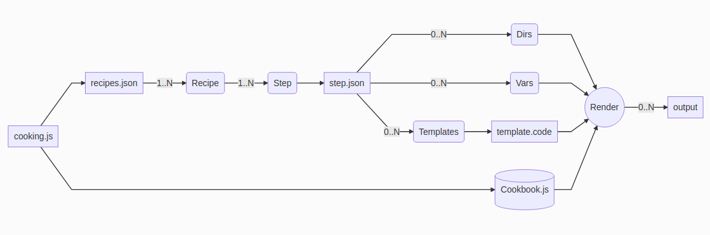

# chicote

Agnostic template engine code generator

(Chicote is a famous Spanish chef)

Chicote need NodeJS to work. Use [mustache.js](https://github.com/janl/mustache.js), [pluralize](https://github.com/plurals/pluralize) and [voca](https://github.com/panzerdp/voca). You don't need install anything, only download code and call cooking.js

```
node cooking.js
```

You need create a recipe.json, recipe contains all ingredients and steps. 

* Ingredient is any value in json. Ingredients are accesible from templates.
* Steps are an array with name "steps". Steps are json files in Step directory

Example of recipe.json

```javascript
{	
    "name": "Test",
	"author": "Bob",
	"fields": [
		{"name": "id", "type": "int"},
		{"name": "firstname", "type": "String"},
		{"name": "lastname", "type": "String"},
		{"name": "birthday", "type": "date"}
	],
	"names": ["HelloWorld", "helloWorld", "hello-world"],
	"steps": ["example"]
}
```

Steps are where you prepare ingredients. One step have three parts: vars, directories, templates
* vars are variables creates from ingredients. Work similar to ingredients
* directories indicates directories to output
* templates, files in template directory 

Example of step
```javascript
{
    "vars":[
        ["filename1", "exampleA-{{timestamp}}.code"],
        ["filename2", "exampleB-{{timestamp}}.code"],
        ["className", "{{#capital}}{{name}}{{/capital}}"],
        ["varName", "{{#decapital}}{{name}}{{/decapital}}"],
        ["moduleName", "{{#dash}}{{name}}Module{{/dash}}"]
    ],	
    "directories":[
        "example/example1",
        "example/example2",
        "examples/example1/example2"
    ],
    "templates":[
        ["example/example1.text", "text.txt"],
        ["example/example1.text", "example/example1/{{filename1}}"],
        ["example/example2.text", "example/example2/{{filename2}}"],
        ["example/example1.text", "examples/example1/{{filename1}}"],
        ["example/example2.text", "examples/example1/example2/{{filename2}}"]
    ]
}
```

Templates uses mustache syntaxis but with a few "special tags":

{{timestamp}} 
{{date}}
{{time}}
{{GUID}}

{{#plural}}text{{/plural}}  
{{#camel}}text{{/camel}}  
{{#capital}}text{{/capital}}   
{{#decapital}}text{{/decapital}}  
{{#dash}}text{{/dash}}  
{{#snake}}text{{/snake}}  
{{#swap}}text{{/swap}}  
{{#title}}text{{/title}}  
{{#lower}}text{{/lower}}  
{{#upper}}text{{/upper}}  

{{#reverse}}text{{/reverse}}  
{{#stripTags}}text{{/stripTags}}  
{{#escHtml}}text{{/escHtml}}  
{{#unHtml}}text{{/unHtml}}  
{{#escRegExp}}text{{/escRegExp}}  
{{#trim}}text{{/trim}}  
{{#latin}}text{{/latin}}  

{{#delSpaces}}text{{/delSpaces}}  
{{#delDuplicateSpaces}}text{{/delDuplicateSpaces}}  

{{#repeat2}}text{{/repeat2}} - repeat text  
{{#repeat3}}text{{/repeat3}}  
{{#repeat4}}text{{/repeat4}}  
{{#repeat5}}text{{/repeat5}}  
{{#repeat6}}text{{/repeat6}}  
{{#repeat7}}text{{/repeat7}}   
{{#repeat8}}text{{/repeat8}}  
{{#repeat9}}text{{/repeat9}}  
  
{{#sortAscL}}text{{/sortAscL}} - sort lines   
{{#sortDescL}}text{{/sortDescL}} - sort lines  
{{#trimL}}text{{/trimL}} - trim lines  
{{#joinL}}text{{/joinL}} - join lines  
{{#removeDuplicateL}}text{{/removeDuplicateL}} - remove duplicate lines  
{{#spaceL}}text{{/spaceL}} -   
{{#space2L}}text{{/space2L}}  
{{#space4L}}text{{/space4L}}  
{{#space8L}}text{{/space8L}}  
{{#tabL}}text{{/tabL}}  
{{#tab2L}}text{{/tab2L}}  
{{#tab3L}}text{{/tab3L}}  
{{#tab4L}}text{{/tab4L}}  
{{#tab5L}}text{{/tab5L}}  
{{#tab6L}}text{{/tab6L}}  
  
{{#log}}text{{/log}} - write text in console   
  
{{#R}}text{{/R}} - render text  
  
{{#C0}}{{/C0}} - set counter = 0  
{{#C+}}{{/C+}} - increase counter  
{{#C-}}{{/C-}} - decrease counter  
{{#C}}{{/C}} - print counter  

{{#K}}text{{/K}}  - load data from knowledge database (cookbook.json)


Example:

```
text: HelloWorld
plural: HelloWorlds
camel: helloWorld
capital: HelloWorld
decapital: helloWorld
dash: hello-world
snake: hello_world
swap: hELLOwORLD
title: HelloWorld
lower: helloworld
upper: HELLOWORLD

text: helloWorld
plural: helloWorlds
camel: helloWorld
capital: HelloWorld
decapital: helloWorld
dash: hello-world
snake: hello_world
swap: HELLOwORLD
title: HelloWorld
lower: helloworld
upper: HELLOWORLD

text: hello-world
plural: hello-worlds
camel: helloWorld
capital: Hello-world
decapital: hello-world
dash: hello-world
snake: hello_world
swap: HELLO-WORLD
title: Hello-World
lower: hello-world
upper: HELLO-WORLD
```

cookbook.js is a json file works as knowledge database, key value json file.

Example of cookbook.js:

```javascript
{	
	"intDefaultValue": " = 0",
	"dateDefaultValue": " = new Date()",
	"stringDefaultValue": " = ''"
}
```



